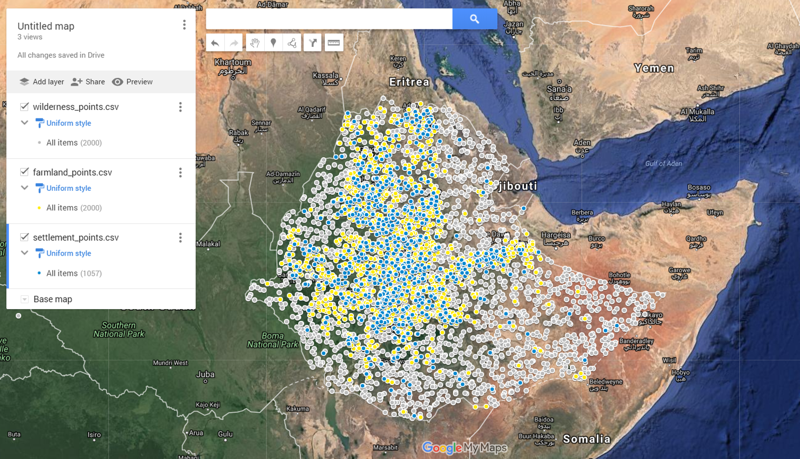
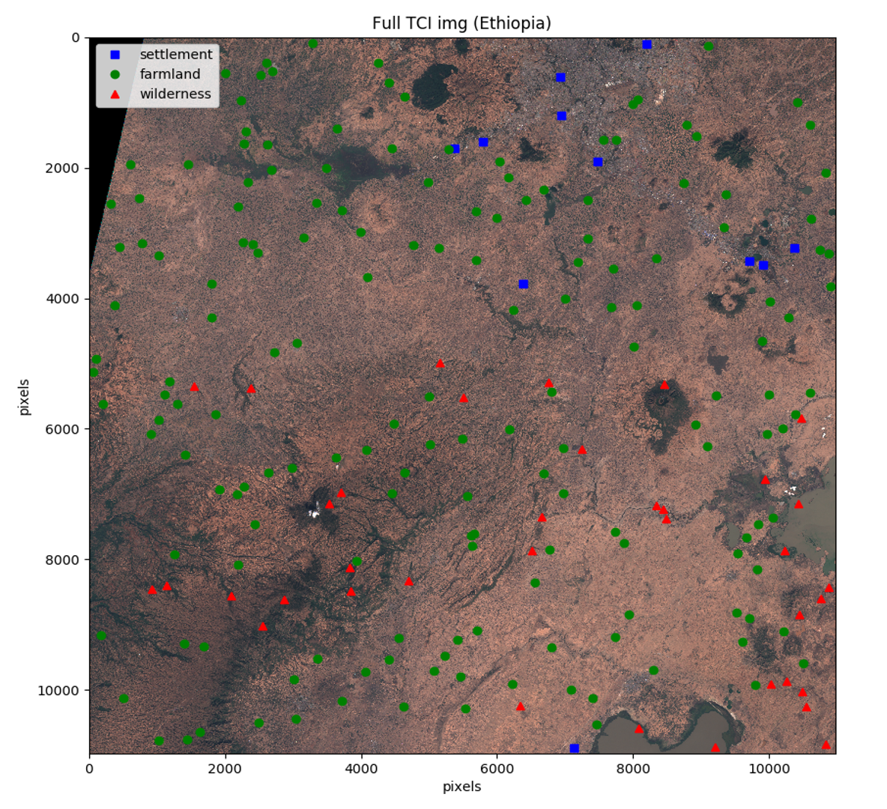
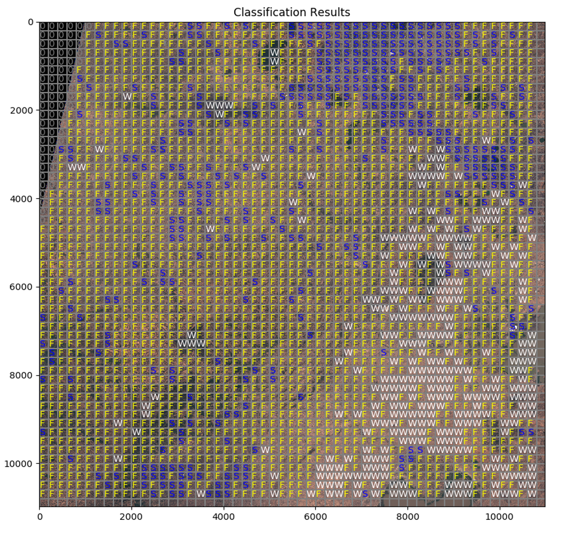
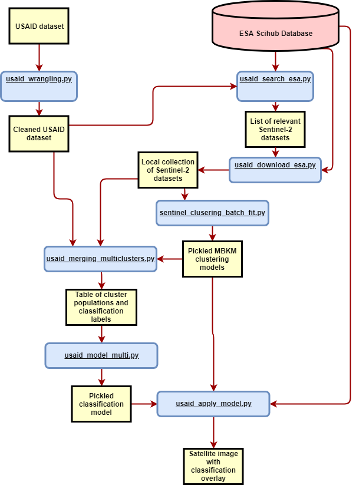

## Summary
A USAID dataset that labels certain geographic areas in Africa based on levels of economic development is combined with hyperspectral imagery from the ESA's Sentinel-2 satellite to develop a classification model for Sentinel-2 imagery. The final model is able to look at any area and determine the coverage of urban development, agricultural development, and undeveloped land.

### The USAID Data Set
Volunteers viewed a set of satellite images and labelled each image based on the level of urban development and agricultural development present within the field of view. The user-created data is summarized in the "user_data.csv" file included in this repository. Nearly all the data points are within Ethiopia. I simplified the user data down to three separate class labels: Settlement, Farmland, or Wilderness. The data set with those simplified class labels can be seen here, plotted over Google Maps:

### Sentinel-2 Imagery
The European Space Agency's Sentinel-2 satellites collect hyperspectral images from a heliocentric orbit. The Sentinel-2 imagery was designed to be optimal for observing trends in vegetation and other enviromental effects. To that end, it collects data using 13 spectral bands spread over the visual and infrared spectrum. An example of the USAID data plotted over a Sentinel-2 image can be seen here (we are zoomed in closer than the previous view; notice that the USAID points only canvas as small portion of the image):

### Results
At this point, the most accurate method of developing a prediction model has been to utilize clustering in the satellite imagery. Then compare samples based on the frequencies of clusters and train Random Forest models on the cluster frequencies.

The clustering algorithm groups pixels together into clusters that share similar spectral charactaristics. This has the effect of enabling the algorithm to identify different materials within the imagery (trees, pavement, specific crops, etc.), despite having no such labels in our dataset. 

When the mixture of various clusters is used to train a Random Forest classifier, we are then able to identify the distribution of the 3 classes on any given Sentinel-2 image. (S = Settlement, F = Farmland, W = Wilderness, 0 = incomplete imagery)

### Method
This data flow diagram shows one of the ways in which we can train and utilize a classification model from the USAID data set and Sentinel-2 imagery.

## Contents
### satellite_head.py
A module containing numerous utilities for accessing and interacting with satellite imagery files from ESA's scihub server.

### usaid_wrangling.py
Handles the raw USAID dataset file that was downloaded from geo-wiki. The main purpose is the clean the dataset and export that refined dataset as a csv file. The script also contains functions for exploring the dataset.

### usaid_search_esa.py
Goes through the list of geographic coordinates in cleaned dataset produced with usaid_wrangling.py. Systematically queries the ESA database for Sentinel-2 imagery containing those coordinates. The list of relevent imagery sets is stored to disk.

### usaid_download_esa.py
Uses the list created by usaid_search_esa.py to download each Sentinel-2 dataset to disk. This can be a lenghty process since ~80GB of data needs to be downloaded.

### sentinel_clusering_batch_fit.py
Samples pixel data from our entire collection of Sentinel-2 imagery and trains one or more unsupervised clustering algorithms that can later be used to assign an id to any pixel based on its spectral similarities to other pixels in the collection. The trained models are pickled for later use by other scripts.

### usaid_merging.py
Uses the clustering algorithms created by sentinel_clustering_batch_fit.py to merge the target labels in the USAID datasets with hyperspectral imagery from Sentinel-2. The basic method is to collect pixels from a view area surrounding a single lat/lon coordinate that was labelled in the USAID set. The narrow field of pixels is then processed to a smaller set of features by using the clustering algorithm. The reduced set of features are packed in a dataframe alongside the USAID label and written to disk. 

### usaid_merging_multiclusters.py
A modification of usaid_merging.py that allows multiple clusering algorithms to be utilized during the same run and thus save computation time. The clustering algorithms must first be trained and pickled using sentinel_clustering_batch_fit.py

### usaid_merging_rbg.py
Another modification of usaid_merging.py that is designed to prepare data for traditional image classification techniques. Only the RGB color channels are loaded from the Sentinel-2 images. Each square view window is saved as a png file. The files are output in a directory structure that can be easily handled by Keras.

### usaid_model_multi.py
Uses the output of usaid_merging.py or usaid_merging_multiclusters.py to train and test classification models. Takes cluster populations as features and the USIAD labels as targets. It is set up to compare numerous algorithms and pre-processing techniques. Cross validation is used to ensure that model performance metrics are valid. Good performing models can be pickled for future predicting.
	
### usaid_transfer_rgb.py
Attempt to use transfer learning to develop a classifier for the RGB images created by usaid_merging_rgb.py. The script loads the VGG-16 convnet model trained on the Imagenet dataset and replaces the original output layer with a fresh fully-connected layer and the 3 class output layer. The new layers are trained on the satellite images, while the rest of the weights are frozen. Still not getting good accuracy.

### usaid_apply_model.py
Loads unlabelled sections of the Sentinel-2 images and applies the trained, pickled model to them. Generates an overlay of the terrain showing the locations of farms, towns, and wilderness areas.

### usaid_apply_model_classy.py
An improved alternative to usaid_apply_model.py which creates a object representing the map with different callable methods for flexible usage.

